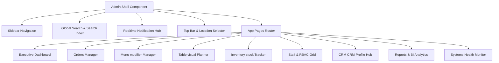

# Enterprise Restaurant Management Platform: Admin Dashboard Architecture & Implementation Plan

A production-grade, high-fidelity, and responsive Admin Dashboard architectural blueprint inspired by major platforms like Square Restaurant, Toast POS, and Lightspeed. This plan structures a multi-tenant enterprise system, outlining the route layout, UI component hierarchy, NestJS/Prisma database models, API specs, and a phased execution roadmap.

---

## Architecture Overview & Technical Stack

The dashboard is built on a modern, scalable, and responsive micro-frontend layout sharing a unified design token system:

- **Framework**: Next.js App Router (React 19, TypeScript) with static pre-rendering and deferred hydration for dynamic components.
- **Styling**: Tailwind CSS & Vanilla CSS variable system (`globals.css`) enforcing a cohesive color palette, glassmorphism containers, smooth animations, and premium dark/light interfaces.
- **State Management**: Zustand for fast global states (active filters, global search, notifications stack) and React Query (`@tanstack/react-query`) for cached backend sync.
- **Visual Data**: SVG-based custom data visualizations, sparklines, and Chart.js-equivalent dashboards to preserve full responsiveness.
- **Realtime Sync**: Socket.io Client for order dispatch, printer statuses, and live kitchen updates.



---

## User Review Required

Please review these major design decisions before we proceed to execution:

> [!IMPORTANT]
> **1. Unified Modular Shell vs Full Page Reloads**
> To maintain instantaneous, high-performance interactions matching a real POS system, we propose wrapping all pages inside a unified layout shell (`AdminShell`). Deep sub-menus (such as POS Settings, Printers, and Integrations) are organized under tabbed views to avoid routing overhead and clutter.
>
> **2. Simulated Printing Engine & Local Service Integration**
> Standard browsers cannot access USB/Ethernet thermal printers directly due to sandbox restrictions. We implement a **simulated POS printer driver** that logs print jobs in `/printers` and supports a preview interface. It uses print styles ready for immediate deployment on a local Node.js printing microservice.
>
> **3. Component Reusability & Data Flow**
> Each screen will share a common container skeleton, supporting `LoadingSpinner` (skeleton loader), `EmptyState` (with friendly icons and CTA), and `ErrorBanner` with fallback logic.

---

## Next.js Routes & Modules Structure

We structure the files under `apps/admin-dashboard/src/app` using a feature-based folder structure:

```
src/
├── app/
│   ├── layout.tsx                     # Global providers, fonts, and dark mode handler
│   ├── page.tsx                       # Dashboard: Executive Overview Screen
│   ├── orders/
│   │   └── page.tsx                   # Orders Management Screen
│   ├── menu/
│   │   └── page.tsx                   # Menu Management (Categories, Items, Addons)
│   ├── tables/
│   │   └── page.tsx                   # Tables Visual Seating & Floor Planner
│   ├── kitchen/
│   │   └── page.tsx                   # KDS Screen & Kitchen Live Analytics
│   ├── customers/
│   │   └── page.tsx                   # CRM: Customer Profiles & Spending Metrics
│   ├── inventory/
│   │   └── page.tsx                   # Inventory Engine: Stock, Ingredients, Suppliers
│   ├── staff/
│   │   └── page.tsx                   # Staff Registry, RBAC Matrix & Attendance
│   ├── settings/
│   │   └── page.tsx                   # POS settings, Taxes, Restaurant Profile, Integrations
│   ├── printers/
│   │   └── page.tsx                   # Printer configuration, Diagnostic logs
│   ├── analytics/
│   │   └── page.tsx                   # Revenue, Dishes, Busy Hours BI Drilldown
│   ├── reports/
│   │   └── page.tsx                   # CSV/PDF Export center, Daily/Weekly/Monthly metrics
│   ├── monitoring/
│   │   └── page.tsx                   # System status board (Heartbeat, Redis, Db, Sockets)
│   ├── logs/
│   │   └── page.tsx                   # Security audit log & operational traces
│   └── globals.css                    # Shared CSS variables & class utilities
```

---

## Comprehensive Component Hierarchy & Layout Designs

Each module is designed with beautiful interfaces, leveraging CSS variables (`--admin-bg`, `--admin-primary`) and Lucide React icons.

### 1. Executive Dashboard (`/`)

- **Left Section (Primary)**:
  - **Stat Grid**: Interactive KPI widgets featuring smooth micro-animations.
    - Today's Revenue (with percentage change vs. yesterday)
    - Active orders (currently open/cooking)
    - Pending tickets (queued for validation)
    - Kitchen speed index (average completion rate)
    - Table occupancy rate (e.g., "18 / 25 tables active")
  - **Revenue Trends**: Interactive bar charts for Daily, Weekly, and Monthly visual comparisons.
  - **Dishes & Recent Orders split**: Top 10 dishes (by count and gross) alongside the 5 most recent orders with status badges.
- **Right Sidebar**:
  - **Orders by Hour**: Service peak indicator (hourly heatmap distribution).
  - **Order Summary Snapshot**: Color-coded donut simulation indicating status breakdown.

### 2. Orders Management (`/orders`)

- **Split-pane Master-Detail layout**:
  - **Left Side (Master List)**:
    - Interactive filters (All, Dine-In, Takeaway, Online, Unpaid, Active)
    - Real-time search bar (by order number, customer name, or table)
    - Multi-action search filters (date range, total ranges)
    - Ticket cards containing elapsed time timers
  - **Right Side (Detail Pane)**:
    - Detailed items list showing customer modifications, quantity, and notes.
    - Receipt panel containing operational actions: `Reprint Receipt`, `Print to Kitchen`, `Mark Paid`.
    - **Refund modal**: Allows single-item selections, custom refund reasons, and instant calculation of restocking requirements.

### 3. Menu Modifier Manager (`/menu`)

- **Tab-oriented Workspace**:
  - **Categories Manager**: Create, reorder, and toggle activation of menus (e.g., Starters, Main, Cocktails).
  - **Items Registry Grid**: Item cards with image previews, inventory badges, and price tags.
  - **Modifiers & Add-ons panel**: Add-on groups (e.g., "Meat Temp", "Sauces", "Extra Cheese") linked with dynamic pricing rules and constraints (e.g. min 1, max 3).

### 4. Seating & Floor Planner (`/tables`)

- **Interactive Views**:
  - **Floor Map Mode**: An interactive grid allowing drag-and-drop table layouts. Displays real-time occupied alerts, customer names, timers, and bill totals.
  - **Grid Mode**: Clean table cards with detailed statuses.
  - **QR Code modal**: Shows high-quality table QR codes with instant print templates (A4 single or sheet layout) and PNG downloaders.

### 5. Kitchen Display System (KDS) & KDS Analytics (`/kitchen`)

- **Live Ticket Rails**:
  - Clean Columns: **Pending** (New/Unconfirmed), **Preparing** (Cooking), and **Ready** (Awaiting pickup).
  - Timers that flash yellow at 8 minutes and pulse red after 15 minutes.
  - Single-click actions to advance orders (e.g., `Start Cooking`, `Set Ready`, `Complete`).
  - **Analytics Header**: Displaying speed averages, tickets closed, and active staff counts.

### 6. Customer CRM (`/customers`)

- **Double Layout**:
  - **Customer Directory**: Searchable list detailing name, phone, lifetime spending, and visit counts.
  - **CRM Profile view**: Displays dynamic spending graphs, a chronologically ordered ticket timeline, and guest preferences (e.g., "Allergies: Nuts").

### 7. Stock & Inventory Engine (`/inventory`)

- **Resource Matrix**:
  - **Ingredients Tracker**: Displays stock quantities (e.g., grams, kg, liters, units), unit cost, and restock levels.
  - **Low-Stock Panel**: Automatically highlights items falling below safe levels with quick `Reorder` buttons.
  - **Suppliers Registry**: Supplier contacts, active contracts, and purchase history.

### 8. Staff Hub & RBAC Matrix (`/staff`)

- **Employee List**: Name, role, contact, active status, and shift attendance markers.
- **Interactive RBAC matrix**: A dynamic grid layout allowing administrators to toggle checkboxes to enable or disable granular operational permissions (e.g., `View Revenue`, `Approve Refunds`, `Edit Menu`) for core roles (ADMIN, MANAGER, CHEF, CASHIER).

### 9. Unified Settings Panel (`/settings`)

- **Tabbed settings sections**:
  - **POS Config**: Currency selector, default tax rates, active discounts (e.g., "Happy Hour - 15%"), and accepted payment methods.
  - **Restaurant Profile**: Hours of operation, name, contact details, and location configurations.
  - **Integrations**: Payment terminal APIs (Stripe POS), WhatsApp gateway settings, and automated SMTP notifications.

### 10. Printers Module (`/printers`)

- **Device grid**: Lists network printers (IP addresses, Port, Status: ONLINE/OFFLINE/LOW_PAPER).
- **Test Printing Console**: Allows admins to trigger instant test slips and monitor live print jobs.

### 11. Custom Reports & BI Analytics (`/reports`)

- **Performance Dashboard**: Charts detailing historical revenue trends.
- **Exports Panel**: Generates customized report summaries (Daily, Weekly, Monthly) for instant printing, PDF download, or CSV exports.

### 12. Security Audit Board & System Monitoring (`/monitoring` & `/logs`)

- **Operational Heartbeat**: Displays API latency, PostgreSQL database connections, Redis caching memory usage, and socket status.
- **Granular Audit Logs**: Chronological event logs detailing user actions (e.g., `"Alex Rivera modified price of Wagyu Burger"`, `"Cashier refunded Ticket #CF-8492"`).
- **Notification drawer**: A unified system center displaying system warnings, low stock alerts, and offline hardware logs.

---

## Database & API Schema Design

To support these robust features, our NestJS backend uses Prisma to manage relational models. Below is the proposed data schema additions:

```prisma
// Proposed Prisma Schema Additions

model Employee {
  id           String        @id @default(uuid())
  name         String
  email        String        @unique
  role         UserRole      @default(CASHIER)
  active       Boolean       @default(true)
  attendance   Attendance[]
  auditLogs    AuditLog[]
  createdAt    DateTime      @default(now())
}

model Attendance {
  id           String        @id @default(uuid())
  employeeId   String
  employee     Employee      @relation(fields: [employeeId], references: [id])
  clockIn      DateTime
  clockOut     DateTime?
  status       String        // PRESENT, LATE, ABSENT
}

model Ingredient {
  id           String        @id @default(uuid())
  name         String
  stockLevel   Float         // Current stock e.g. 52.4
  unit         String        // kg, liters, units
  minAlertLevel Float        // Alert threshold e.g. 10.0
  unitPrice    Float
  supplierId   String?
  supplier     Supplier?     @relation(fields: [supplierId], references: [id])
  purchases    PurchaseRecord[]
}

model Supplier {
  id           String        @id @default(uuid())
  name         String
  contactName  String
  phone        String
  email        String
  ingredients  Ingredient[]
}

model PurchaseRecord {
  id           String        @id @default(uuid())
  ingredientId String
  ingredient   Ingredient    @relation(fields: [ingredientId], references: [id])
  quantity     Float
  cost         Float
  purchasedAt  DateTime      @default(now())
}

model Printer {
  id           String        @id @default(uuid())
  name         String
  ipAddress    String
  port         Int           @default(9100)
  type         String        // RECEIPT, KITCHEN
  status       String        // ONLINE, OFFLINE, LOW_PAPER
}

model AuditLog {
  id           String        @id @default(uuid())
  employeeId   String?
  employee     Employee?     @relation(fields: [employeeId], references: [id])
  action       String        // UPDATE_PRICE, PROCESS_REFUND
  details      String        // JSON string of modifications
  createdAt    DateTime      @default(now())
}

model CustomerProfile {
  id           String        @id @default(uuid())
  name         String
  phone        String        @unique
  email        String?
  notes        String?
  lifetimeSpend Float        @default(0.0)
  visitCount   Int           @default(0)
  createdAt    DateTime      @default(now())
}
```

---

## Phased Implementation Plan

We divide the development into 5 strategic phases to guarantee testability and maintain zero regression.

### Phase 1: Shell Architecture, Navigation & Routing Framework

- Set up App Router folders for all 18 modules.
- Update `AdminShell` to map all links to physical page directories.
- Add responsive mobile menu toggle and collapsible state.
- Implement custom state hook in `Zustand` for global search matching and notifications display.

### Phase 2: CRM, Staff Registry, and Permissions Control Panel

- Implement `/customers` page including search filters and preference notes.
- Create `/staff` interface detailing employee registries and attendance status indicators.
- Build the dynamic RBAC Permission Matrix grid allowing live config saves.

### Phase 3: Kitchen Display Station (KDS) & Custom Printer Console

- Build `/kitchen` page layout featuring reactive tickets and service speed charts.
- Implement `/printers` configuring devices, IP testing utilities, and simulated receipts.

### Phase 4: Stock & Inventory Management Engine, Monitoring & Audit Logs

- Build `/inventory` resource tracking, alerts thresholds, and supplier logs.
- Implement `/monitoring` representing interactive heartbeats of database, Redis, and ports.
- Design `/logs` outputting clean, sortable chronological audit logs.

### Phase 5: Advanced POS Settings, Third-Party integrations & BI Reports

- Build `/settings` tabbed sections containing tax configurations, Stripe integrations, and opening hours.
- Implement `/reports` enabling users to view data visualizations and export CSV/PDF.

---

## Verification Plan

We will perform strict end-to-end verifications of both performance and visual consistency:

### 1. Verification Commands

- Run complete TypeScript validation:
  ```bash
  pnpm -r typecheck
  ```
- Test Next.js static builds:
  ```bash
  pnpm --filter @repo/admin-dashboard build
  ```

### 2. Manual Inspection & Responsive Checks

- Inspect the responsive mobile menu toggle in Chrome DevTools using mobile device simulation.
- Verify the appearance of all 18 modules in dark mode.
- Run print simulations to ensure printable areas fit standard receipts cleanly.
- Confirm loading states transition smoothly without triggering page jumps.
